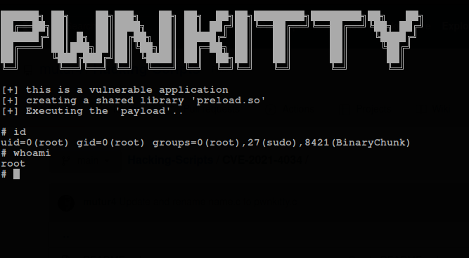

#### CVE-2021-4034

This is a C script that is used to exploit the __*Local Privilege Escalation Vulnerability*__ 
that was discovered by [Qualys Security Team](https://blog.qualys.com/vulnerabilities-threat-research/2022/01/25/pwnkit-local-privilege-escalation-vulnerability-discovered-in-polkits-pkexec-cve-2021-4034).

>The Qualys Research Team has discovered a memory corruption vulnerability in polkit’s pkexec, a SUID-root program that is installed by default on every major Linux distribution.

#### Proof Of Concept

*The following image is used to show the payload in action in a debian based operating system*

